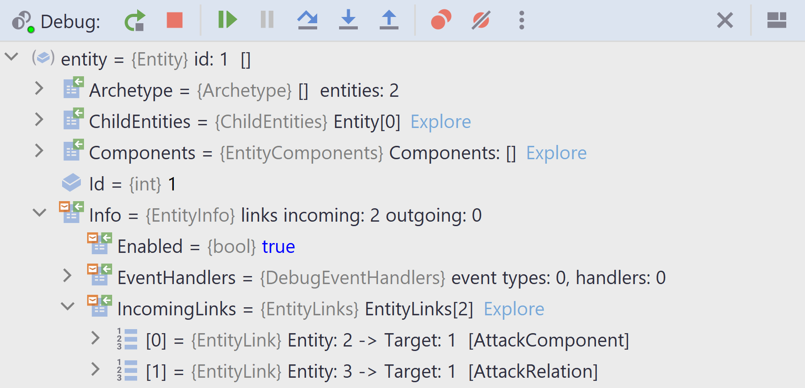

An entity relationship is a *directed* link between two entities.

Typical use case for entity relationships in a game are:
- Attack systems
- Path finding / Route tracing
- Model social networks. E.g friendship, alliances or rivalries
- Inventory Systems
- Build any type of a [directed graph](https://en.wikipedia.org/wiki/Directed_graph)
  using entities as *nodes* and links or relations as *edges*.

Entity relationships are modeled as components or relations.  
*Directed link* means that a link points from a **source** entity to a **target** entity.  
The entity containing a link component / relation is the **source** entity.

There are two interfaces used to define entity relationships with entity links:

1. [ILinkComponent](https://github.com/friflo/Friflo.Engine-docs/blob/main/api/ILinkComponent.md) -
   An entity can have only one link component per type at a time.

2. [ILinkRelation](https://github.com/friflo/Friflo.Engine-docs/blob/main/api/ILinkRelation.md) -
   An entity can have multiple link relations - one per **target** entity.

Now you might ask why having specialized component types for entity links.  
You can simply add an `Entity` field to a component type and you are done.  
This is absolutely correct but the specialized types provide the following features.

**Features of entity links**

- Get link component of an entity with `entity.GetComponent<AttackComponent>()` in O(1).

- Get link relations of an entity with `entity.GetRelations<AttackRelation>()` in O(1).

- Get entities including outgoing links referencing a specific **target** entity with  
  `target.GetIncomingLinks<AttackComponent>()` in O(1).  This make links **bidirectional**.

- Automatically removing links from all entities having a link to a **target** entity that is deleted.

- Get all entities in an EntityStore linked by a specific link component using  
  `store.LinkComponentIndex<AttackComponent>().Values` in O(1).

- Add multiple links to a single entity using [Link Relations](#link-relation).

- Show and navigate all incoming entity links in a debugger

<br/>

</img>  
*Screenshot:* Show and navigate all incoming entity links in a debugger at `Info.IncomingLinks`


**Comparison to implementations in other ECS projects.**  

Entity relationships in **flecs** and **BEVY** are modeled as component/entity pairs added to entities.  
The main differences are:

- In **flecs** links between entities can be created adhoc.  
  This ECS requires to define a specific component type to create links between entities.  
  This simplifies code navigation and establish a clear overview what types of links are used in a project.

- The API to create and query relations in **flecs** is very compact but not very intuitive - imho.  
  It is completely different from common component handling.
  See [flecs ⋅ Relationships](https://github.com/SanderMertens/flecs/blob/master/docs/Relationships.md)

- Adding, removing or updating a link does not cause [archetype fragmentation](https://www.flecs.dev/flecs/md_docs_2Relationships.html#fragmentation).  
  In **flecs** every relationship between two entities creates an individual archetype only containing a single entity / component.  
  So each entity relationship allocates ~ 1000 bytes required by the archetype stored in the heap for each link.  
  The more significant performance penalty is the side effect in queries. Many archetypes need to be iterated if they are query matches.

- Changing an entity link does not cause a structural change.  
  In **flecs** a new archetype needs to be created and the old archetype gets empty.  

Big shout out to [**fenn**ecs](https://github.com/outfox/fennecs) and [**flecs**](https://github.com/SanderMertens/flecs)
for the challenge to improve the feature set and performance of this project!

<br/>


## Link Component

A link component enables adding a link to another **target** entity.  
An entity can have only one link component per type at a time.  
Link components are added, removed and queried like common components with
```cs
    entity.AddComponent(new AttackComponent { target = entity2 });
    entity.GetComponent    <AttackComponent>();
    entity.RemoveComponent <AttackComponent>();
    entity.HasComponent    <AttackComponent>();
```

The following example illustrate the state changes by small text graphs on the right.  
Link components are represented by `→` icon.  
This example show the graph changes when adding link components or deleting entities.

```cs
struct AttackComponent : ILinkComponent {
    public  Entity  target;
    public  Entity  GetIndexedValue() => target;
}

public static void LinkComponents()
{
    var store   = new EntityStore();

    var entity1 = store.CreateEntity(1);                            // link components
    var entity2 = store.CreateEntity(2);                            // symbolized as →
    var entity3 = store.CreateEntity(3);                            //   1     2     3
    
    // add a link component to entity (2) referencing entity (1)
    entity2.AddComponent(new AttackComponent { target = entity1 }); //   1  ←  2     3
    // get all incoming links of given type.    O(1)
    entity1.GetIncomingLinks<AttackComponent>();        // { 2 }

    // update link component of entity (2). It links now entity (3)
    entity2.AddComponent(new AttackComponent { target = entity3 }); //   1     2  →  3
    entity1.GetIncomingLinks<AttackComponent>();        // { }
    entity3.GetIncomingLinks<AttackComponent>();        // { 2 }

    // deleting a linked entity (3) removes all link components referencing it
    entity3.DeleteEntity();                                         //   1     2
    entity2.HasComponent    <AttackComponent>();        // false
}
```
<br/>


## Link Relation

A link relation enables adding multiple links to a single entity referencing other **target** entities.  
There can be only one link relation per **target** entity.  
Link relations are added, removed and queried with
```cs
    entity.AddRelation(new AttackRelation { target = entity1 });
    entity.AddRelation(new AttackRelation { target = entity2 });
    entity.RemoveRelation <AttackRelation>(entity1);
    entity.GetRelations   <AttackRelation>();               // O(1)
    entity.GetRelation    <AttackRelation,Entity>(entity2); // O(1)
```

Methods to mutate and query link relation are at
[RelationExtensions](https://github.com/friflo/Friflo.Engine-docs/blob/main/api/RelationExtensions.md).

The following example illustrate the state changes by small text graphs on the right.  
Link relations are represented by `→` icon.  
This example show the graph changes when adding link relations or deleting entities.

```cs
struct AttackRelation : ILinkRelation {
    public  Entity  target;
    public  Entity  GetRelationKey() => target;
}

public static void LinkRelations()
{
    var store   = new EntityStore();
    
    var entity1 = store.CreateEntity(1);                          // link relations
    var entity2 = store.CreateEntity(2);                          // symbolized as →
    var entity3 = store.CreateEntity(3);                          //   1     2     3
    
    // add a link relation to entity (2) referencing entity (1)
    entity2.AddRelation(new AttackRelation { target = entity1 }); //   1  ←  2     3
    // get all links added to the entity. O(1)
    entity2.GetRelations    <AttackRelation>();     // { 1 }
    // get all incoming links. O(1)
    entity1.GetIncomingLinks<AttackRelation>();     // { 2 }
    
    // add another one. An entity can have multiple link relations
    entity2.AddRelation(new AttackRelation { target = entity3 }); //   1  ←  2  →  3
    entity2.GetRelations    <AttackRelation>();     // { 1, 3 }
    entity3.GetIncomingLinks<AttackRelation>();     // { 2 }
    
    // deleting a linked entity (1) removes all link relations referencing it
    entity1.DeleteEntity();                                       //         2  →  3
    entity2.GetRelations    <AttackRelation>();     // { 3 }
    
    // deleting entity (2) is reflected by incoming links query
    entity2.DeleteEntity();                                       //               3
    entity3.GetIncomingLinks<AttackRelation>();     // { }
}
```